# Computer Vision in Tennis

### Group: 22
### Members: 

#### Alexandru Bobe: 5069831
#### Bogdan Simion: 5850185
#### Onno Verberne: 5883407
             

#### This project was done in part to satisfy the requirements for the Seminar Computer Vision by Deep Learning course at TU Delft.
----

We aim to reproduce and to improve some parts of the paper "TenniSet: A Dataset for Dense Fine-Grained Event Recognition, Localisation and Description". In this blog we’ll be elaborating on our efforts to reproduce the results, the issues we faced and the discussion about possible future work that builds on it.

## Table of Contents  
**[Introduction](#Introduction)** 
**[Previous work](#Previous-work)** 
**[Methodology](#Methodology)** 
**[Experiments & Results](#Experiments&Results)** 
**[Issues](#Issues)** 
**[Discussions](#Discussions)** 

## Introduction

In the world of sports, technological advancements have brought about remarkable changes, captivating players and spectators alike. From the introduction of Video Assistant Referee (VAR) in football to the groundbreaking Hawk-Eye system in tennis, the possibilities for leveraging technology in sports seem boundless. These advancements have opened doors to exciting applications that benefit players, coaches, and enthusiasts. In particular, tennis has witnessed the emergence of Hawk-Eye, a computer vision system that automates refereeing by precisely tracking the ball's trajectory using an array of sophisticated cameras. On top of its immediate use to help umpires make better decisions, the system also creates a huge and up-to-date dataset that can improve the game in multiple directions.  However, despite the potential for this data to bridge the gap between players of different economic backgrounds, they have, unfortunately, only served to magnify it, in the sense that the richest players in the world afford to analyse it and get an almost unfair advantage against emerging players.

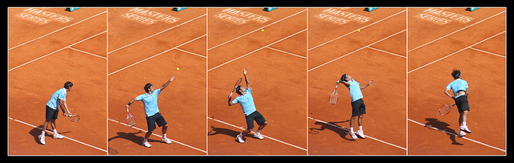

Therefore, our goal is to explore the open-source research related to Computer Vision in tennis, understand its shortcomings and replicate the most promising work while keeping the idea of economic accessibility in mind throughout the whole project.

## Previous work

From the outset of our project, we recognized that the scope of our work would heavily rely on acquiring timely and relevant data. As a result, our initial literature review focused specifically on papers that provided publicly available data, in order to identify research that could be reproduced. This process led us to a disheartening realization: open-source tennis research has stagnated due to a profound lack of high-quality data accessible for scholarly investigation. It became apparent that the complexity of projects undertaken by commercial entities far surpassed the capabilities of the open-source research community. Supporting our hypothesis, Mora [^5] eloquently elaborates on this issue in her paper, shedding light on the scarcity of data for open-source tennis research and the challenges posed by its low quality and limited scale. This compelling evidence solidifies the urgent need to address the data deficit in order to propel open-source tennis research forward.

The contribution of Mora [^5] to the field of Computer Vision applied to tennis is significant. She presents a comprehensive framework for in-play tennis analysis using computer vision for object detection, motion tracking, and player tracking. Using these techniques, the system offered an innovative approach to analyzing in-play tennis events, providing a deeper understanding of player movements, shot recognition, and other relevant aspects of the game. Afterwards, we explored how we can also achieve the same results and maybe even improve them by using the more recent developments in the field.

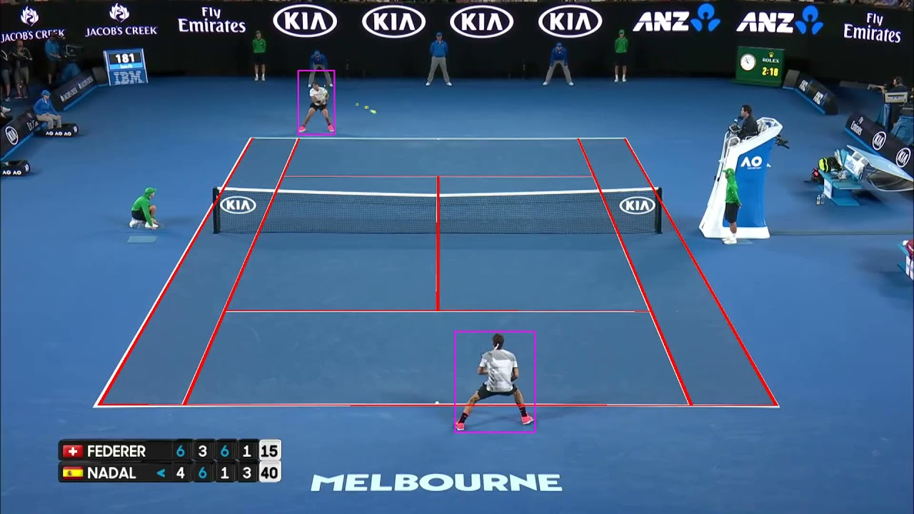

The first logical step was to understand how to track the ball. The paper by Huang et al. [^2] introduces TrackNet, a deep learning network specifically designed for tracking high-speed and small objects in sports applications. This work addresses the challenges associated with tracking objects such as balls or players in fast-paced sports scenarios, where objects can be both small in size and rapidly moving.

The second step was to find how we can track the players. Of course, all the iterations of the YOLO [^6] model were good candidates for our system, but we wanted to check if there are more task-specific models. While looking for a better alternative, we found a completely different solution proposed by Faulkner et al. [^4]. Instead of tracking the players and the ball with bounding boxes and later analyse their positions for getting insights, Faulkner *skipped* the step of tracking and went directly to action detection by analysing the frames of the video. Using this technique, they were able to perform frame classification, event detection and recognition and automatic commentary generation. Moreover, compared to most other papers, the dataset was publicly available and it was possible to reproduce the results.   

<!-- Information on optical flow models -->

## Methodology

In this section, we described our dataset together with the preprocessing steps, the splitting and the sampling technique used. Afterwards, we describe the models along with some implementation details. 
<!-- I think we also need to name the real time performance we are looking for somewhere in the intro -->
<!-- I wasn't sure what the end story would be. I put it for now that we were looking for "economical accesibility". -->
### Dataset
The dataset created by Faulkner et al. is based on videos of official tennis matches. The dataset contains 5 videos of full tennis matches, corresponding to more than 200GB of frames. Given our computation power limitation, we chose to use only a single video, which resulted in around 80k frames.
The frames are part of 11 classes, meaning 
* the first letter describing: Serve or Hit, 
* second letter: Far or Near, depending where the player is positioned in the frame 
* last letter: has multiple options, explained in the figure:
 
 

  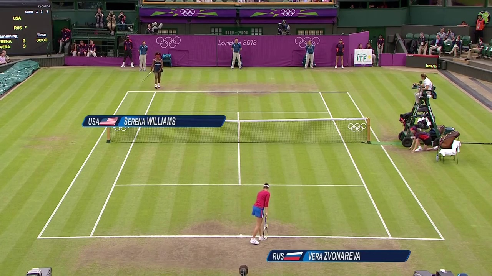

  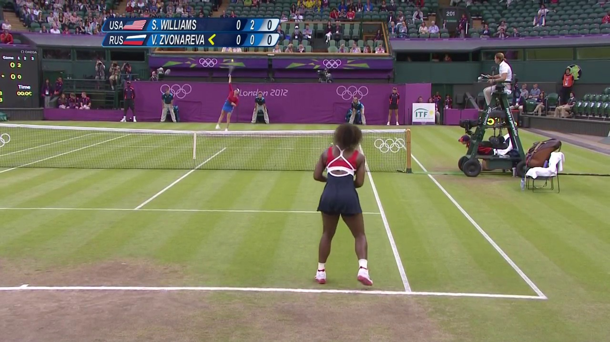 
  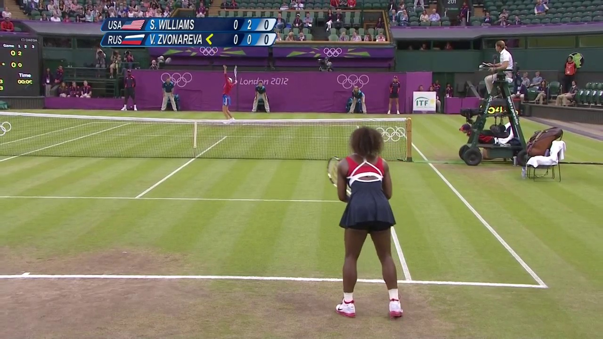
  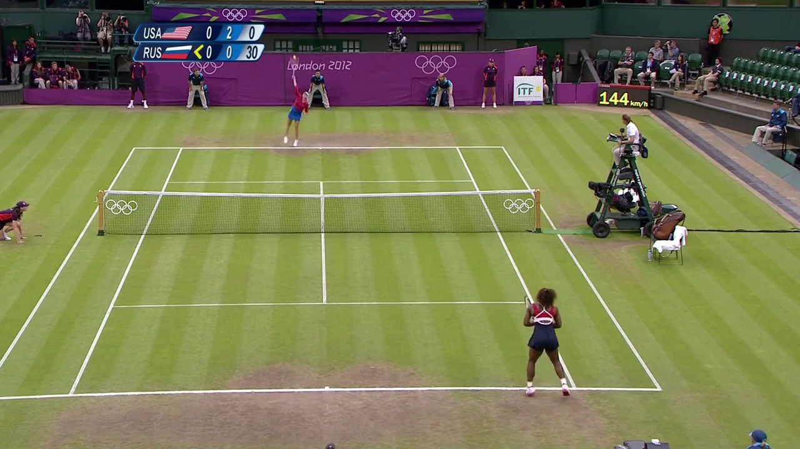
  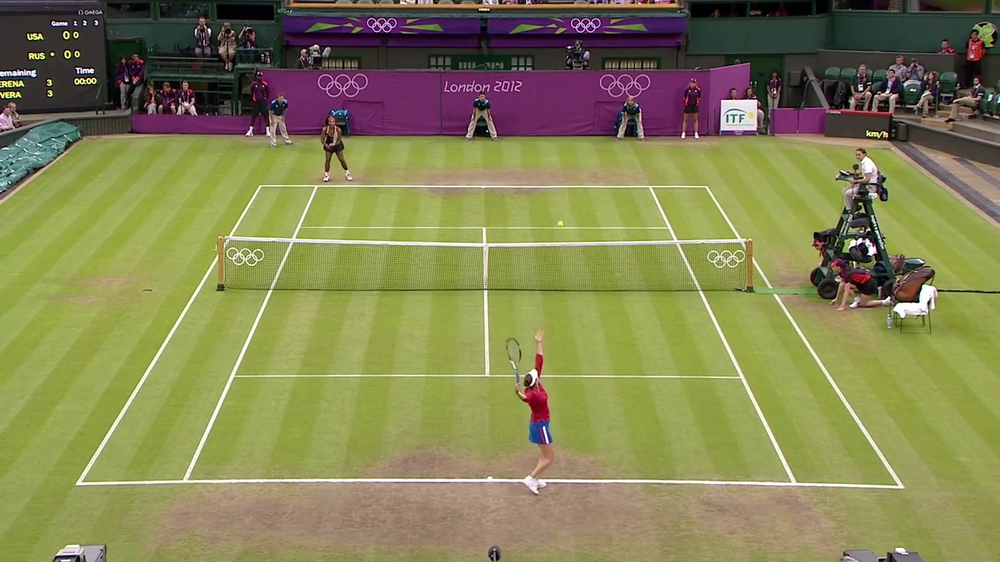 
  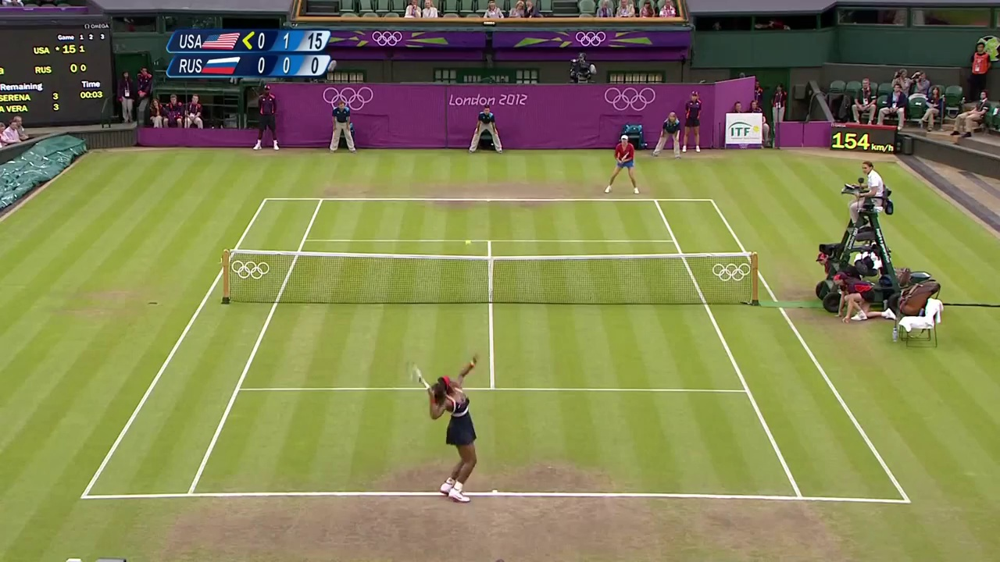
  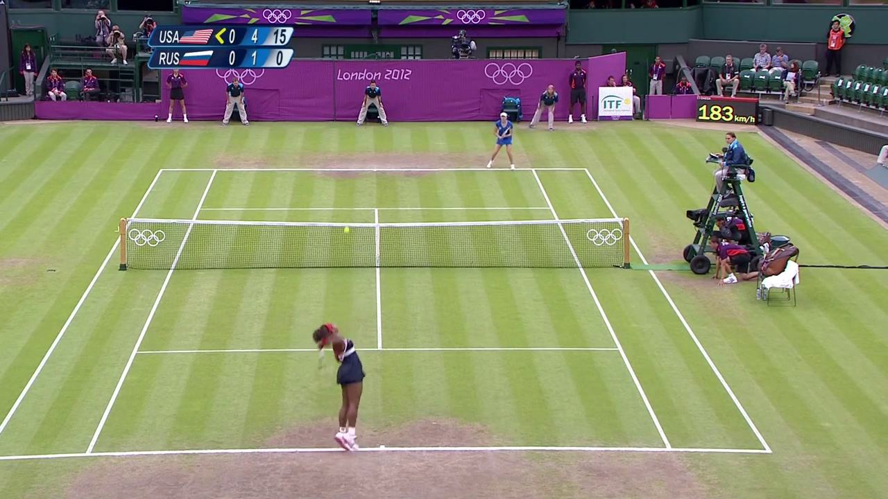

  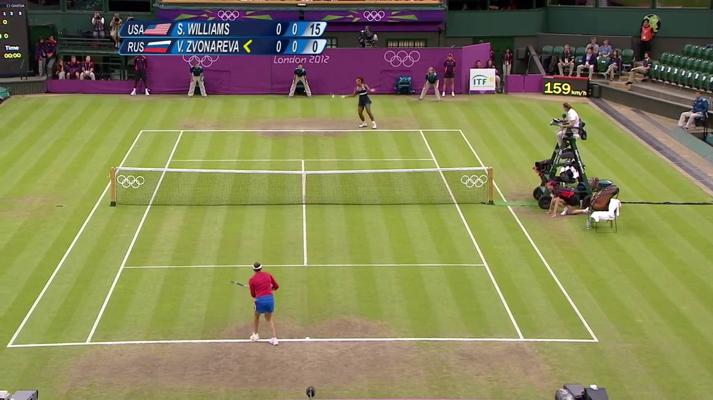 
  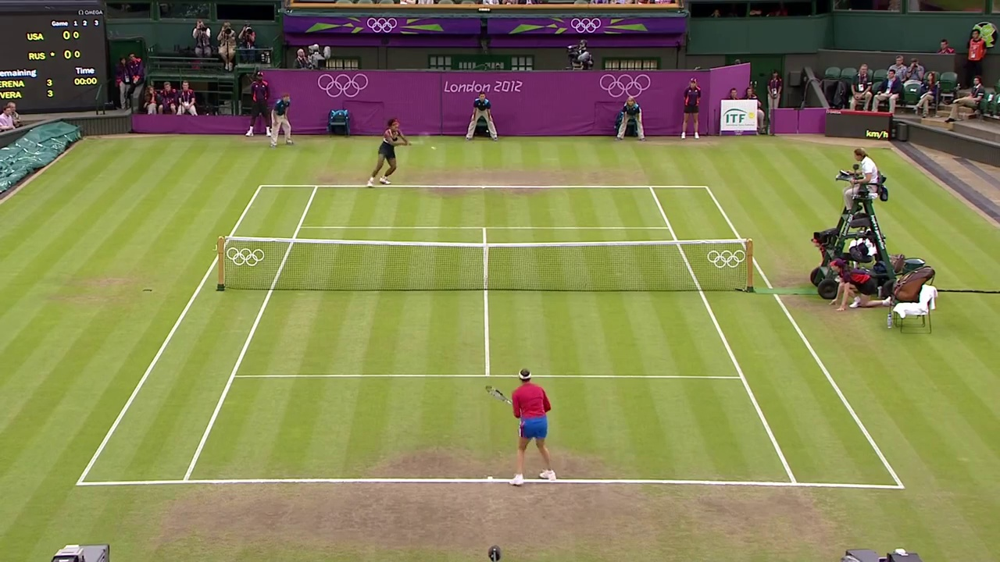
  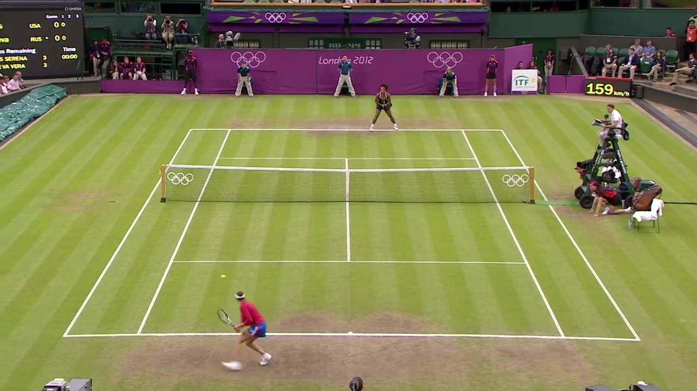
  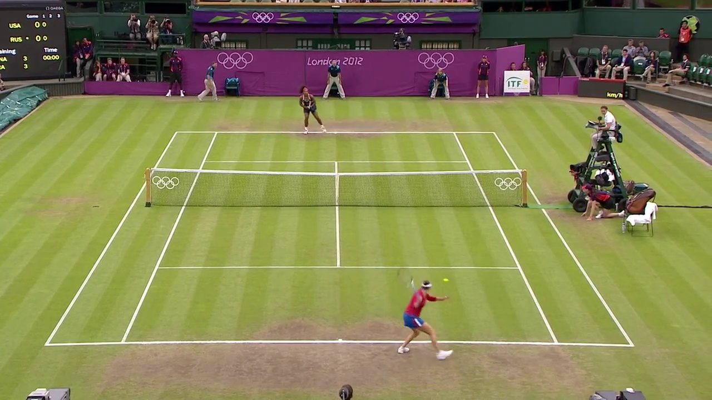 

In order to improve the performance of the model we performed the following transformations, as explained in the paper.
* Center Crop (as most information is in the middle of the frame)
* Resizing to 512x512
* Mean subtraction

We note that the official repository has additional transformations that are not presented in the paper that might have influenced the presented accuracies.

### VGG16
The paper uses as a baseline a VGG16 architecture with a decreased number of neurons for the last dense layer(256) and a single dense layer instead of two, since they claim it has no negative effect on the performance. Throughout the whole paper, the criterion used is the Cross-Entropy Loss. 

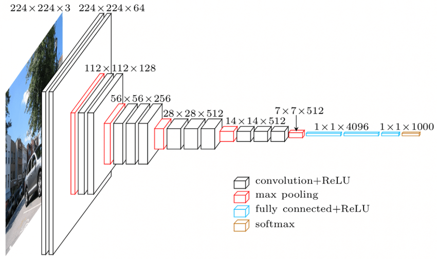

### Optical flow
In the 2017 paper by Faulkner et al. they demonstrate that the inclusion of optical flow data increases their models' performance. The inclusion of motion information seems logically and empirically important for classification of tennis videos. However, the optical flow model FlowNet [^7] dates back to 2015 and is quite slow, not ideal for real-time calculation. Over the years much more efficient models have been created, namely PWC-net [^8] by Nvidia and RAFT [^9] are two strong competitors. We have opted to use the latter RAFT as there is an existing easy to use pretrained pytorch implementation.

#### Two-Stream
In addition to the pure optical flow model, Faulkner et al. also proposed a two-stream model, where a standard VGG16 model and an optical flow VGG16 model have their features joined as they are passed into the classifier part of VGG16. This model saw the greatest performance across the board, at the cost of doubling the number of parameters.

### Knowledge Distillation
In order to make the process more affordable for everyone and maybe achieve real-time analysis, we had to integrate our system into a cheaper network that doesn't take as much time and resources to predict. A natural step towards this goal was knowledge distillation [^10]. Since VGG16 is known for its deep architecture, we wanted to use a smaller network, called MobileNet with around 5M parameters, compared to the more than 100M in VGG16. In order to perform knowledge distillation, we used the teacher-student training loop, illustrated below:

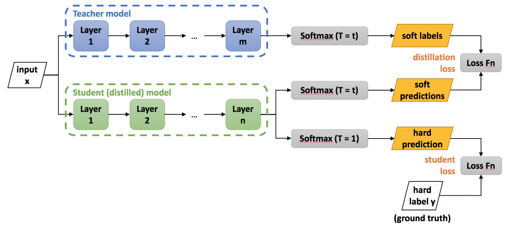
<!-- TODO - Alex: Teacher-student with mobilenet_v3_large as student and VGG16 as teacher -->
<!-- TODO: Big cumbersome network, make it smaller via student teacher or craft distillation
 -->

#### Craft Distillation
Another novel approach to model compression is craft distillation [^11], where a network is compressed layer by layer. A convolutional block (e.g. convolution + normalization + activation) is replaced by two or more separable convolution [^12] blocks. Eventhough a single block is replaced by two separable blocks, the number of parameters is still reduced. The distillation process is then as follows:

1. Select a convolutional block to replace
2. Train a student block on the input and output features of the "teacher" block using a regression loss such as MSE.
3. Replace the teacher with the student.
4. Do fine-tuning on the entire model using the cross entropy loss
5. Repeat for the other convolutional blocks.

### Learning rate scheduling
During training the loss can vary wildly, possibly caused by gradient steps being too large. To combat this issue we opted to use four different learning rate schedulers: Step-wise, Linear, Reduce on pleateau, and Cosine Annealing With Warm Restarts [^13]. The linear scheduler is chosen as it starts with a lower learning rate which anneals over time. Starting slower could prevent the model from overshooting the local optimum induced by the pre-trained weights. By the same token, cosine annealing with warm restarts has been shown to increase the convergence speed of deep CNNs and could help reduce the training loss variance over time.

## Experiments & Results
To determine the efficacy our proposed improvements to the TenniSet paper we first had to reproduce their results. However, shortly into the project we found out just how much storage and compute was required. The smallest video in the dataset, video 8, at 54 minutes in length and about 1 GiB in size ended up being over 20 GiB after frame extraction. This made it very difficult to run the experiments on Google Colab, and we had run the experiments locally. On our own hardware the training time of 1 model sometimes exceeded 7 hours. Thus, after the initial experiments we have limited ourselves to the base pre-trained VGG16 model due to memory and time constraints.

### Model Comparisons
The results of the accuracy on the training and validation sets are found in the table below. We have also included the confusion matrices on the validation set of each model as heatmaps. From the results in the table below it can be observed that the base model has an accuracy of 50%, a 15 percentage point reduction w.r.t the reported accuracy by Faulkner et al. [^4]. Interestingly, the inclusion of optical flow data had a negative effect on classification performance. The optical flow model saw a 36% reduction in relative accuracy to the base model on the validation set, similar to only optimizing the classifier section of VGG16. Additionally, the two-stream model performed no better than the base VGG16 model. We hypothesise that the pre-trained weights in conjunction with the low amount of training data made it hard for the models to generalize much beyond their pre-trained performance, as similar to Faulkner et al. each component is optimized ore pre-trained before being joined for end-to-end training.

TABLE OF TRAIN/VAL ACCURACIES FOR: RGB, RGB CLASSIFIER ONLY, OF, TWO-STREAM + CONFUSION MATRICES

In the graphs below, it can be seen that for the base and two-stream models the training loss is converging to a local optimum, whereas the loss of the optical flow and classifier only models stagnates right from the start. This fact is also reflected in the validation accuracies. Our hypothesis for the behaviour of the optical flow model is similar to our previous hypothesis: the global optimum for the optical flow model is likely so far away from its current local optimum, induced by the pre-trained weights, that it is very hard to escape it with so little data.

GRAPHS OF TRAIN LOSS AND VAL ACCURACY (I ALREADY HAVE THESE)

Furthermore, the high variance in the training loss stood out to us, we conjectured two causes for this. Firstly, the class imbalance causes the model to overfit on the more prevalent classes, as a novel class sample will then cause the loss to greatly increase. Secondly, we propose that the learning rate requires more tuning as the variance in training losses could indicate that the gradient steps are too large.

### Learning rate scheduling
From the graphs below it can be seen that none of the schedulers significantly reduce the variance in the training loss, thus disproving our learning rate hypothesis. Although an initial boost in validation performance is observed, the base model outperforms every scheduler after five epochs.

* PolynomialLR (Power = 2)

  

* StepLR (step_size = 1, gamma=0.1)

 

 

GRAPHS OF TRAIN LOSS AND VAL ACCURACY (ALMOST FINISHED RUNNING)

### Network Distillation
Network distillation yielded no positive results. In order to measure the performance of the knowledge distillation approach, we first trained the MobileNet network with the same settings as the base VGG. Afterwards, we trained the same architecture with the teacher-student method. 
Unfortunately, after the first epoch, the loss increased to infinity and we could not fix the issue:
 

There are a lot of factors that could have influenced this behaviour and we leave the fix of this issue as future work.  

Likewise, the craft distillation lost all of its accuracy after just one epoch. In the confusion matrices below it can be seen that after one round of distillation all model outputs belonged to the two most prevalent classes. After the second layer had been distilled and refined the model only output the most prevalent class.

HEATMAP OF CONFUSION MATRIX

<!-- ## Issues
<!-- Maybe we can write these our experiments section? -->
<!-- TODO: comparatively low computation power, runs taking very very long, lots of data so online is harder, running out of memory issues too -->

## Conclusion and Future Work

#### a

## References

[^1]: Owens, N. E. I. L., Harris, C., & Stennett, C. (2003, July). Hawk-eye tennis system. In 2003 international conference on visual information engineering VIE 2003 (pp. 182-185). IET.
[^2]: Huang, Y. C., Liao, I. N., Chen, C. H., İk, T. U., & Peng, W. C. (2019, September). TrackNet: A deep learning network for tracking high-speed and tiny objects in sports applications. In 2019 16th IEEE International Conference on Advanced Video and Signal Based Surveillance (AVSS) (pp. 1-8). IEEE.
[^3]: Dosovitskiy, A., Fischer, P., Ilg, E., Hausser, P., Hazirbas, C., Golkov, V., ... & Brox, T. (2015). Flownet: Learning optical flow with convolutional networks. In Proceedings of the IEEE international conference on computer vision (pp. 2758-2766).
[^4]: Faulkner, H., & Dick, A. (2017, November). Tenniset: a dataset for dense fine-grained event recognition, localisation and description. In 2017 International Conference on Digital Image Computing: Techniques and Applications (DICTA) (pp. 1-8). IEEE.
[^5]: Mora, Silvia Vinyes. Computer Vision and Machine Learning for In-Play Tennis Analysis: Framework, Algorithms and Implementation. Diss. Imperial College London, 2018.
[^6]: J. Redmon, S. Divvala, R. Girshick and A. Farhadi, "You Only Look Once: Unified, Real-Time Object Detection," 2016 IEEE Conference on Computer Vision and Pattern Recognition (CVPR), Las Vegas, NV, USA, 2016, pp. 779-788, doi: 10.1109/CVPR.2016.91.
[^7]: Dosovitskiy, A., Fischer, P., Ilg, E., Häusser, P., Hazirbas, C., Golkov, V., van der Smagt, P., Cremers, D., & Brox, T. (2015). FlowNet: Learning Optical Flow with Convolutional Networks. 2015 IEEE International Conference on Computer Vision (ICCV), 2758-2766.
[^8]: Sun, D., Yang, X., Liu, M., & Kautz, J. (2017). PWC-Net: CNNs for Optical Flow Using Pyramid, Warping, and Cost Volume. 2018 IEEE/CVF Conference on Computer Vision and Pattern Recognition, 8934-8943.
[^9]: Teed, Z., & Deng, J. (2020). RAFT: Recurrent All-Pairs Field Transforms for Optical Flow. European Conference on Computer Vision.
[^10]: Hinton, G., Vinyals, O., & Dean, J. (2015). Distilling the knowledge in a neural network. arXiv preprint arXiv:1503.02531.
[^11]: C. Blakeney, X. Li, Y. Yan and Z. Zong, "Craft Distillation: Layer-wise Convolutional Neural Network Distillation," 2020 7th IEEE International Conference on Cyber Security and Cloud Computing (CSCloud)/2020 6th IEEE International Conference on Edge Computing and Scalable Cloud (EdgeCom), New York, NY, USA, 2020, pp. 252-257, doi: 10.1109/CSCloud-EdgeCom49738.2020.00051.
[^12]: Guo, Y., Li, Y., Feris, R.S., Wang, L., & Simunic, T. (2019). Depthwise Convolution is All You Need for Learning Multiple Visual Domains. AAAI Conference on Artificial Intelligence.
[^13]: Loshchilov, I., & Hutter, F. (2016). SGDR: Stochastic Gradient Descent with Restarts. ArXiv, abs/1608.03983.
