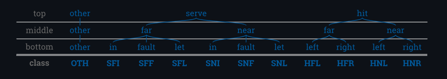
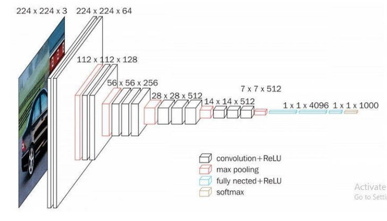
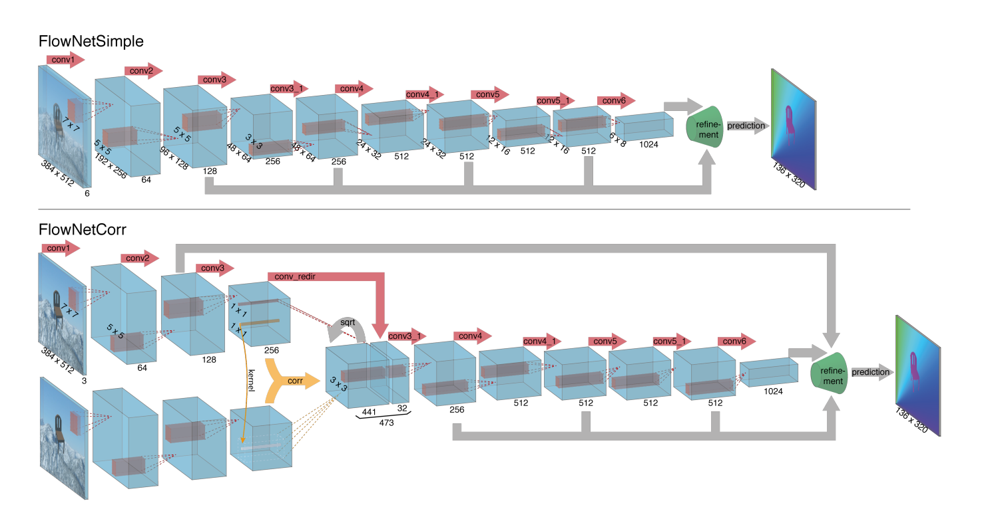

# Computer Vision in Tennis

### Group: 22
### Members: 

#### Alexandru Bobe: 5069831
#### Bogdan Simion: 5850185
#### Onno Verberne: 5883407
             
#### This project was done in part to satisfy the requirements for the Seminar Computer Vision by Deep Learning course at TU Delft.
#### We aim to reproduce and to improve some parts of the paper "TenniSet: A Dataset for Dense Fine-Grained Event Recognition, Localisation and Description". In this blog we’ll be elaborating on our efforts to reproduce the results, the issues we faced and the discussion about the possibility of reproducing the paper.

## Table of Contents  
**[Introduction](#Introduction)** 
**[Previous work](#Previous-work)** 
**[Project goals](#Project-goals)** 
**[Methodology](#Methodology)** 
**[Results](#Results)** 
**[Issues](#Issues)** 
**[Discussions](#Discussions)** 

## Introduction

#### Tennis, similar to every other field that has benefited from technology, has experienced significant advancements. Since Hawk-Eye developement [^1] many algorithms detecting the players' action, the score and tracking the ball were made. Some of the recent improvements in the field were encompassed by TrackNet [^2], which trains a deep learning network, addressing the problem of tracking fast moving tiny objects and Optical Flow [^3], a currently widely used technique for detecting moving objects. In terms of datasets, an important advancement was made by Faulkner and Dick [^4], who created the TenniSet, a dataset focused on event detection based on the players movements and ball's position. However, there are some flaws: the slow computation time makes it impossible to use these approaches for any real-time analysis of a tennis match. Furthermore, these techniques are not yet cheap and viable ways to create an annotated dataset that could be further used in research. Thus, we successfully some parts of the TenniSet paper as well as providing a new, faster approach for handling real-time tennis annotation. Last but not least, we would like to divide our discussion into several parts: the previous work related to annotation using computer vision in sports; our project goals and what we are trying to implement; the results we have for this setting and in the end, the discussion about the results and issues we faced.

## Previous work

#### One of the first groundbreaking innovations in terms of technologies used is Hawk-Eye [^1]. The Hawk-eye tennis system is a cutting-edge technology designed to enhance decision-making in tennis matches. By utilizing advanced image processing techniques and sophisticated algorithms, Hawk-eye can accurately track the trajectory of the ball during gameplay. The system employs a network of high-speed cameras strategically positioned around the court to capture multiple angles of the ball's movement. The Hawk-eye technology has revolutionized the game of tennis by providing players, officials, and spectators with real-time, accurate information on ball placement. It has become a valuable tool in resolving disputed calls, as it allows officials to review and make more informed decisions on whether the ball landed in or out of bounds. The system's ability to provide quick and objective insights has greatly enhanced the fairness and integrity of the sport.

#### The paper by Vinyes Mora [^5] presents a comprehensive framework for in-play tennis analysis using computer vision and machine learning techniques. This work builds upon previous research in the field of sports analysis, specifically focusing on real-time analysis of tennis matches. The author proposes a novel framework that combines computer vision algorithms and machine learning methodologies to extract meaningful insights from visual data obtained during live tennis matches. The paper contributes to the existing body of literature by presenting a detailed description of the framework and its underlying algorithms. It highlights the importance of computer vision techniques such as object detection, motion tracking, and player tracking, as well as the role of machine learning algorithms for classification and prediction tasks. The proposed framework offers an innovative approach to analyzing in-play tennis events, providing a deeper understanding of player movements, shot recognition, and other relevant aspects of the game.

#### The paper by Huang et al. [^2] introduces TrackNet, a deep learning network specifically designed for tracking high-speed and small objects in sports applications. This work addresses the challenges associated with tracking objects such as balls or players in fast-paced sports scenarios, where objects can be both small in size and rapidly moving. The authors present TrackNet as a novel solution that combines the power of deep learning with specialized techniques for tracking objects in sports. The network architecture is designed to effectively handle the complexities of tracking high-speed objects by incorporating features such as motion prediction, object recognition, and temporal modeling.

#### Faulkner et. al [^4] created a database of annotated tennis matches for automatic tennis commentary generation, called TenniSet. It is designed to encompass a wide range of tennis-specific events, enabling researchers and practitioners to develop and evaluate algorithms and models for event recognition and understanding. It includes detailed annotations for various events that occur during a tennis match, such as serves, volleys, forehands, backhands, and other distinct actions and movements. The dataset provides dense annotations, meaning that it offers precise temporal and spatial information about the occurrences of different events. This level of granularity allows for more nuanced and accurate event recognition and localization. Additionally, the Tenniset dataset includes textual descriptions of the events, providing valuable context and aiding in comprehensive event understanding.

## Project goals

#### We aim to reproduce some parts of the Computer Vision algorithms presented in [^3], namely event detection and recognition as well as providing a new approach. To improve the performance of tennis annotation we propose adding an optical flow component to the network which will serve as a secondary input to the annotation network. To address the computational costs of optical flow calculations we propose two methods. The first one is frame interpolation, designed in "RIFE: Real-Time Intermediate Flow Estimation for Video Frame Interpolation", where we use a network to calculate the intermediate optical flow frames. The paper here uses network distillation to improve the performance of an existing optical flow frame interpolation network. The second one is network distillation, designed in "Craft Distillation: Layer-wise Convolutional Neural Network Distillation". Our goal is to distill an existing optical flow network layer by layer using Craft Distillation.

#### In order to make sure that we were right about what is missing and that our proposed solution is feasible, we start by reproducing the results obtained by Faulkner et. al. Afterwards, we try to see if their solution generalizes to unseen videos of official tennis matches. To test our proposed solution, we use the same dataset and analyse our newly trained models from different perspectives including accuracy and training time.  

## Methodology

#### In this section we would like to discuss the algorithms used in our implementation, along with the necessary explanations.

### Creating the dataset

#### First of all, we need to convert from video to frames using Python's specialized computer vision library: OpenCV. We set to have 50 frames per second as this number was the most compatible with all the algorithms used in our implementation. In short, it reads each frame of the video, checks for any errors in frame reading, and saves the valid frames as individual image files. The total count of saved frames is then printed. After creating the images, we need to save them into a more organised dataset. Therefore, we created TennisDataset for working with tennis-related image data and it is designed to be compatible with PyTorch's dataset interface. One throwback we saw during training is that the classes are imbalanced, so we undersampled the dataset to address this. Undersampling involves reducing the number of instances of the most frequent class to match the frequency of the second most frequent class.

#### In total, there are 11 labels we assign to the frames, and they are explained better in the following screenshot from the Tenniset [^4] Github page.

### VGG16

#### The VGG16 architecture consists of a series of convolutional layers, followed by fully connected layers. It is named "VGG16" because it has 16 weight layers, including 13 convolutional layers and 3 fully connected layers. The convolutional layers are designed to extract hierarchical features from the input images, while the fully connected layers act as a classifier to predict the class labels.

#### Each convolutional layer in VGG16 applies a set of learnable filters to the input image. These filters capture different aspects of the image, such as edges, textures, and shapes. The filters are small in spatial dimension but extend across the full depth of the input volume, enabling the model to learn rich spatial representations.

#### In VGG16, the convolutional layers are stacked on top of each other, with occasional max pooling layers in between. The max pooling layers downsample the spatial dimensions of the feature maps, reducing the computational complexity and increasing the receptive field of the subsequent layers.

#### The fully connected layers in VGG16 take the output of the last convolutional layer, flatten it into a 1-dimensional vector, and process it through a series of densely connected layers. The final fully connected layer produces the output predictions by employing a softmax activation function, which assigns probabilities to each class label.

#### During the training phase, VGG16 is typically trained using the backpropagation algorithm with gradient descent optimization. The weights of the network are updated iteratively to minimize a loss function, such as categorical cross-entropy, by comparing the predicted probabilities with the ground truth labels.

### Optical Flow

#### Optical flow refers to the pattern of apparent motion of objects in a sequence of images or video frames. It provides valuable information about the movement of objects and can be used for various computer vision tasks, such as object tracking, motion analysis, and video stabilization. To compute optical flow, we leverage the assumption that pixel intensities of objects in consecutive frames tend to remain constant unless affected by motion. Based on this assumption, several algorithms have been developed to estimate the motion vectors of pixels between frames.

#### More recently, deep learning-based methods have been developed to estimate optical flow. These approaches utilize convolutional neural networks (CNNs) to learn complex motion patterns and capture long-range dependencies. Networks like FlowNet and PWC-Net have achieved state-of-the-art performance in optical flow estimation by training on large-scale annotated datasets. In our study, we use optical flow as a key component in our methodology to analyze and track the motion of players and tennis balls in our tennis dataset.

### Network Distillation

## Results

#### a

## Issues

#### Imbalanced classes

## Discussion

#### a

## References

[^1]: Owens, N. E. I. L., Harris, C., & Stennett, C. (2003, July). Hawk-eye tennis system. In 2003 international conference on visual information engineering VIE 2003 (pp. 182-185). IET.
[^2]: Huang, Y. C., Liao, I. N., Chen, C. H., İk, T. U., & Peng, W. C. (2019, September). TrackNet: A deep learning network for tracking high-speed and tiny objects in sports applications. In 2019 16th IEEE International Conference on Advanced Video and Signal Based Surveillance (AVSS) (pp. 1-8). IEEE.
[^3]: Dosovitskiy, A., Fischer, P., Ilg, E., Hausser, P., Hazirbas, C., Golkov, V., ... & Brox, T. (2015). Flownet: Learning optical flow with convolutional networks. In Proceedings of the IEEE international conference on computer vision (pp. 2758-2766).
[^4]: Faulkner, H., & Dick, A. (2017, November). Tenniset: a dataset for dense fine-grained event recognition, localisation and description. In 2017 International Conference on Digital Image Computing: Techniques and Applications (DICTA) (pp. 1-8). IEEE.
[^5]: Mora, Silvia Vinyes. Computer Vision and Machine Learning for In-Play Tennis Analysis: Framework, Algorithms and Implementation. Diss. Imperial College London, 2018.

